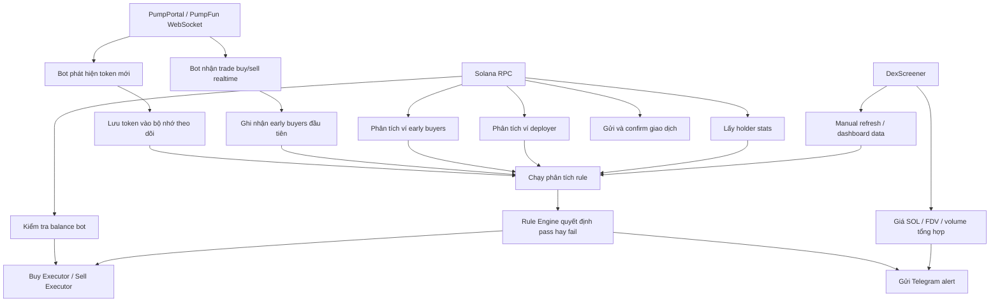
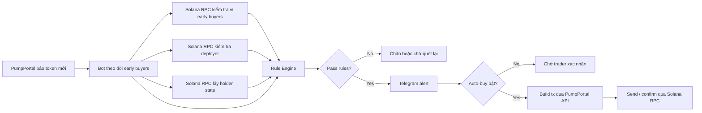

# DATA FLOW FOR TRADERS

File này giải thích bot đang lấy dữ liệu từ đâu, RPC dùng để làm gì, và mỗi nguồn dữ liệu ảnh hưởng tới quyết định mua/bán như thế nào.

Mục tiêu:

- Trader mới vào nhìn là hiểu
- Không cần đọc code vẫn nắm được bot vận hành ra sao
- Phân biệt rõ `PumpPortal`, `Solana RPC`, và `DexScreener`

## Nhìn nhanh trong 30 giây

Bot này đang dùng 3 nguồn chính:

1. `PumpPortal / PumpFun WebSocket`
- Dùng để phát hiện token mới và trade mới theo thời gian thực
- Đây là nguồn nhanh nhất để bot thấy token vừa tạo và ai vừa mua

2. `Solana RPC`
- Dùng để kiểm tra dữ liệu on-chain
- Ví dụ: lịch sử ví, nguồn tiền của ví, top holders, balance, confirm giao dịch

3. `DexScreener`
- Dùng để lấy dữ liệu market dạng tổng hợp
- Ví dụ: FDV / market cap, volume, giá SOL
- Chủ yếu phục vụ refresh dashboard và review lại token

## Sơ đồ tổng thể

## Hiểu đơn giản từng nguồn

### 1. PumpPortal / PumpFun WebSocket

Nguồn này để làm gì:

- Phát hiện token mới ngay khi launch
- Theo dõi trade buy/sell của token mới
- Biết ai là những ví mua sớm đầu tiên

Trader nên hiểu thế này:

- Đây là "mắt thần realtime" của bot
- Nếu không có nguồn này, bot sẽ không thể sniper sớm

Bot lấy gì từ đây:

- `mint`
- `symbol`
- `name`
- `deployer`
- `marketCapSol`
- `solAmount` của từng lệnh buy/sell
- trạng thái bonding curve

Ví dụ ứng dụng:

- đếm 5 ví mua sớm đầu tiên
- xem có nhiều ví mua cùng cỡ tiền hay không
- theo dõi token đang tăng market cap ra sao

## 2. Solana RPC

Đây là phần trader hay nghe nhiều nhưng dễ hiểu sai.

RPC trong bot này không phải để "phát hiện token mới".

RPC đang được dùng chủ yếu để:

- kiểm tra dữ liệu on-chain
- xác minh ví
- lấy holder stats
- gửi và confirm lệnh

### RPC giúp bot phân tích gì

#### A. Phân tích ví early buyer

Bot dùng RPC để:

- lấy balance ví
- lấy signatures gần đây
- đọc một số parsed transactions gần đây
- đo ví mới hay ví cũ
- suy nguồn tiền đi vào ví

Mục tiêu trader cần hiểu:

- bot đang cố xem ví này có phải ví trắng không
- ví đó có được fund từ deployer không
- ví đó có vẻ organic hay insider

#### B. Phân tích deployer

Bot dùng RPC để:

- lấy balance deployer
- lấy signatures gần đây của deployer
- ước lượng deployer này có vẻ là serial deployer hay không

Lưu ý quan trọng:

- hiện tại phần này vẫn mang tính heuristic
- chưa phải forensic-grade analysis

#### C. Lấy holder stats

Bot dùng RPC để:

- lấy các token accounts lớn nhất
- loại trừ một số PumpFun system accounts
- ước lượng top holders concentration

Trader nên hiểu:

- đây là dữ liệu để check concentration
- nhưng hiện tại nó vẫn là bản ước lượng nhanh

#### D. Gửi lệnh mua / bán

Sau khi transaction được build, bot dùng RPC để:

- gửi raw transaction
- confirm transaction
- kiểm tra balance trước khi mua
- lấy recent priority fee

Nói ngắn gọn:

- không có RPC thì bot không thể xác minh và không thể gửi lệnh on-chain bình thường

## 3. DexScreener

DexScreener không phải nguồn phát hiện token mới.

Bot dùng DexScreener chủ yếu để:

- manual refresh một token cũ
- lấy FDV / market cap tổng hợp
- lấy volume tổng hợp
- lấy giá SOL để đổi ra USD
- cập nhật dashboard / PnL view

Trader nên hiểu:

- DexScreener hợp để xem lại và refresh
- nhưng không phải nguồn tốt nhất cho quyết định sniper sớm ở giây đầu

## Sơ đồ ra quyết định mua

## Một cách hiểu rất thực tế cho trader

Hãy tưởng tượng như sau:

- `PumpPortal WS` = người báo tin cực nhanh
- `Solana RPC` = người đi xác minh xem tin đó có thật không
- `DexScreener` = bảng điện tổng hợp để xem lại thị trường

Bot sniper tốt cần cả 3:

- nhanh để thấy cơ hội
- đủ xác minh để không vào mù
- có dashboard để xem lại và quản trị

## RPC hiện tại phục vụ chính xác những việc nào

Danh sách ngắn gọn:

- đọc balance ví bot
- đọc balance ví early buyers
- đọc signatures ví
- đọc parsed transactions gần đây
- batch lấy account info
- lấy token largest accounts
- lấy recent prioritization fees
- gửi transaction
- confirm transaction

## Điều trader mới nên nhớ

### Điều 1

Nếu bot phát hiện token mới rất nhanh, công đầu là `PumpPortal WebSocket`, không phải RPC.

### Điều 2

Nếu bot nói một ví là white wallet hay insider, phần đó đang dựa nhiều vào `Solana RPC` và heuristic phân tích ví.

### Điều 3

Nếu dashboard refresh market cap / volume của token cũ, nhiều khả năng dữ liệu đó đến từ `DexScreener`.

### Điều 4

Nếu bot mua hoặc bán thành công, bước gửi và confirm giao dịch vẫn cần `Solana RPC`.

## Kết luận ngắn

Trong dự án này:

- `PumpPortal` lo tốc độ phát hiện
- `Solana RPC` lo xác minh on-chain và thực thi giao dịch
- `DexScreener` lo dữ liệu market tổng hợp để review / refresh

Nói dễ hiểu:

- muốn vào nhanh: nhìn `PumpPortal`
- muốn kiểm tra ví và holder: dùng `RPC`
- muốn xem tổng quan giá trị thị trường: dùng `DexScreener`

